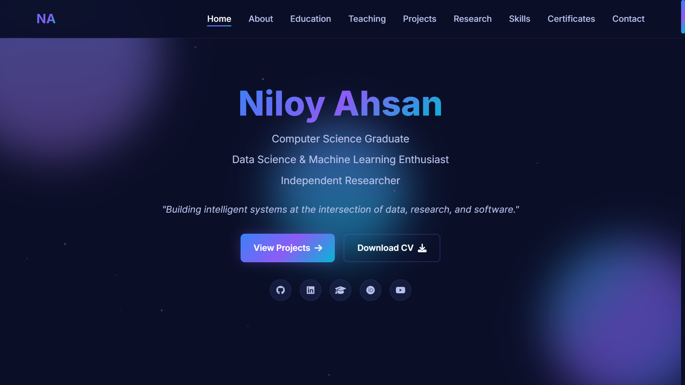

# Portfolio Website

## Welcome to my **personal portfolio website**!
This project showcases my skills, projects, and experiences as a developer, designed to provide a clean and modern interface for visitors to learn more about me.

## Live Demo
Check out the deployed portfolio here: [Portfolio](https://niloyahsan.netlify.app)

## 📸 Demo Screenshot
<p align="center">
  
</p>

## 📂 Project Structure
```
├── index.html
├── styles.css
├── script.js
├── assets/
└── README.md
```

## 🛠️ Technologies Used
- **HTML5** – Semantic structure  
- **CSS3** – Styling and responsive design  
- **JavaScript** – Interactivity and dynamic elements  

## ✨ Features
- Responsive design for mobile and desktop  
- Smooth navigation and interactive UI  
- Sections for **About Me, Projects, Skills, and Contact**  
- Deployed on **Netlify** for easy access  

## 📬 Contact
Created by **Niloy Ahsan**  
- GitHub: [@niloyahsan1](https://github.com/niloyahsan1)  
- Portfolio: [niloyahsan](https://niloyahsan.netlify.app)

---